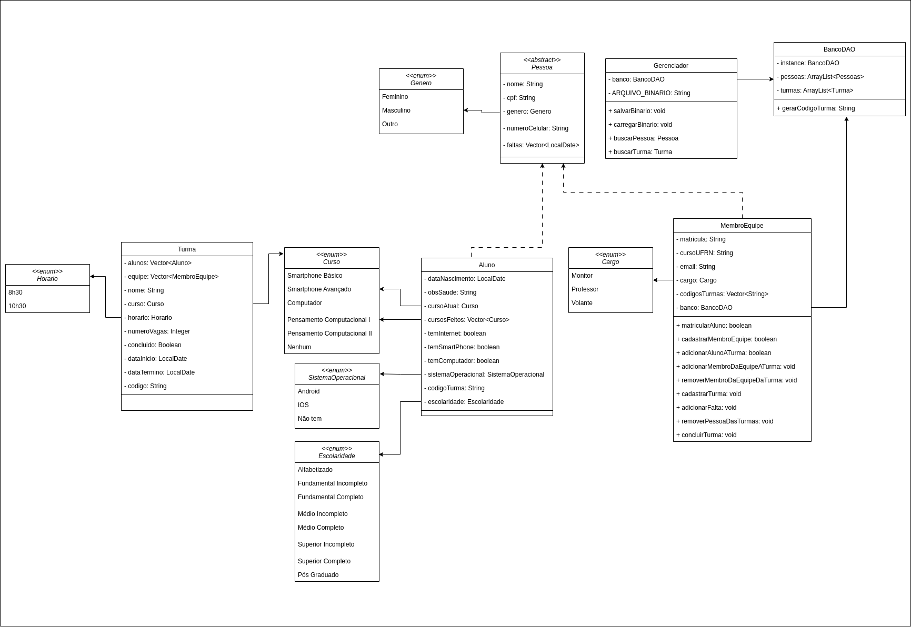
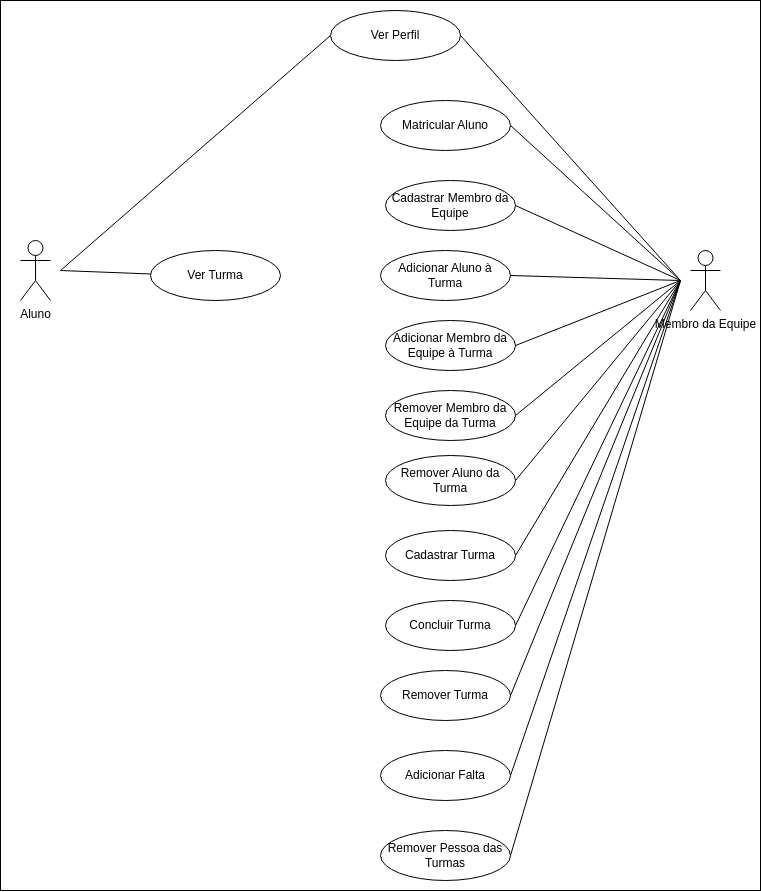

# Sistema ProEIDI

Sistema para gestão do Projeto de Extensao de Inclusao Digital para pessoa Idosa, desenvolvido para a materia de Linguagem de Programação 2 com **Java** e **JavaFX**.

## Índice

- [Video](#Video)
- [Diagramas](#Diagrama de Classes)
- [Contribuição](#contribuição)

## Video

[Assista ao vídeo](https://drive.google.com/file/d/1x2mwhO2-hTOzwcdMPXVNWPEy5he2O8Yu/view?usp=sharing) para entender o funcionamento do projeto.

## Diagrama de Classes

## Diagrama de Casos De Uso

## Contribuição

Este trabalho foi desenvolvido pelas alunas Bianca Medeiros e Marina Medeiros, que trabalharam juntas em todas as partes do projeto, desde a implementação do código até o design da interface gráfica. Ambas contribuíram para modificar e melhorar todos os arquivos do sistema, garantindo que tudo funcionasse. Como é necessária a descrição da contribuição de cada integrante ao
projeto decidimos resumir da seguinte maneira:

- Model: Marina
- Interfaces: Bianca
- Controllers : Marina + Bianca
